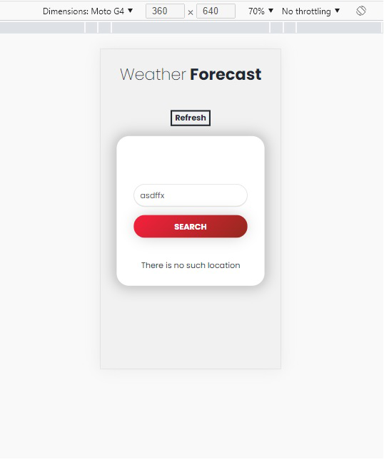
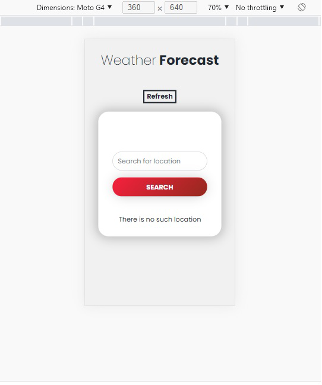
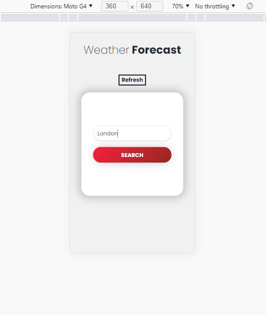
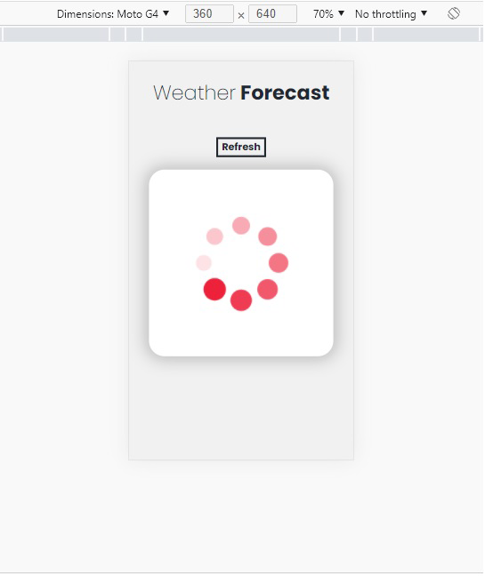
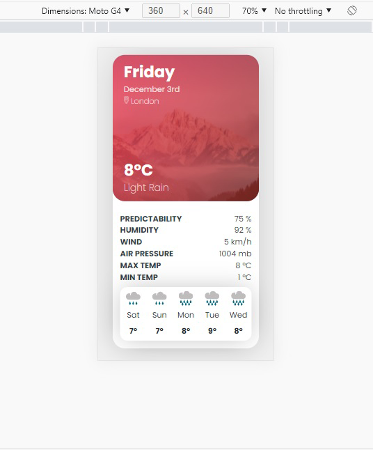

# Weather app (with react)

#### Forecast weather app for european countries.
I an app that fetches data from the MetaWeather API and consumes
this data in a front-end build with react.

      

#### Features
- Fetch data from API
- Animations
- responsive web app

#### Livedemo
- [weather-forecast](https://weather-forecast-ceci.netlify.app/)

## Getting started
- clone the project
- run `npm install`
- run `npm start`

## Author
👤 [Cecilia Benitez](https://ceciliabenitez.com/)

## Contributing

Contributions, issues and feature requests are welcome!

Feel free to check the [issues page](https://github.com/Ceci007/react-weather-app/issues)

## Show your support

Give a star if you like this project!

## 📝 License

This project is MIT licensed.
